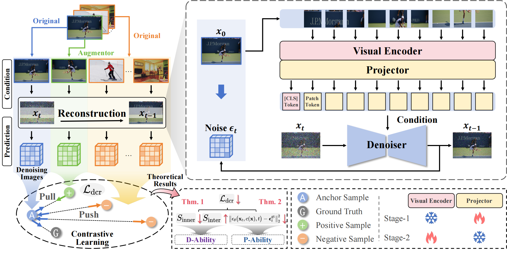

<div align="center">
  
</div>

# Guiding Diffusion-based Reconstruction with Contrastive Signals for Balanced Visual Representation (CVPR 2026)

<p align="center">
<a href="https://arxiv.org/pdf/2603.04803">"></a>
<a href="" target='_blank'>

</a>
</p>


**Author:** [Boyu Han](https://boyuh.github.io/), [Qianqian Xu*](https://qianqianxu010.github.io/), [Shilong Bao](https://statusrank.github.io/), [Zhiyong Yang](https://joshuaas.github.io/), [Ruochen Cui](https://github.com/421zuoduan), Xilin Zhao, [Qingming Huang*](https://qmhuang-ucas.github.io/)



## ✨ Updates

[2026-3-6] 🔥 Released our `DCR` code. We warmly welcome everyone to use it and give feedback or suggestions!

[2026-2-27] Our paper has been accepted to `CVPR 2026`.

## 🔧 Prepare

### Installation

* Clone the repository

  ```bash
  git clone https://github.com/boyuh/DCR.git
  ```

* Install the required packages:

  ```bash
  conda create -n DCR python=3.10 -y
  conda activate DCR
  pip install --upgrade pip
  pip install -r requirements.txt
  ```

### Dataset

* Download CC3M dataset. Please refer to [here](https://github.com/rom1504/img2dataset/blob/main/dataset_examples/cc3m.md) for more details.

* Place the CC3M dataset in the `dataset` folder with the following structure:

  ```bash
  DCR
  ├── dataset
  │   └── CC3M
  └── ...
  ```

### Pretrained Models

- Download the pre-trained Stable Diffusion model. We recommend [Stable Diffusion v2.1](https://huggingface.co/Manojb/stable-diffusion-2-1-base).

- Download the pre-trained CLIP model. Please refer to the following links:

  |      CLIP Backbone      |         Model Name         |                             Link                             |
  | :---------------------: | :------------------------: | :----------------------------------------------------------: |
  | OpenAICLIP ViT-L-14@224 |   clip-vit-large-patch14   |  [🤗](https://huggingface.co/openai/clip-vit-large-patch14)   |
  | OpenAICLIP ViT-L-14@336 | clip-vit-large-patch14-336 | [🤗](https://huggingface.co/openai/clip-vit-large-patch14-336) |
  |  MetaCLIP ViT-L-14@224  |  metaclip-l14-fullcc2.5b   | [🤗](https://huggingface.co/facebook/metaclip-l14-fullcc2.5b) |
  |  MetaCLIP ViT-H-14@224  |  metaclip-h14-fullcc2.5b   | [🤗](https://huggingface.co/facebook/metaclip-h14-fullcc2.5b) |
  |  SigLIP ViT-SO-14@224   | siglip-so400m-patch14-224  | [🤗](https://huggingface.co/google/siglip-so400m-patch14-224) |
  |  SigLIP ViT-SO-14@384   | siglip-so400m-patch14-384  | [🤗](https://huggingface.co/google/siglip-so400m-patch14-384) |

- Place the pre-trained models in the `pretrained_weights` folder with the following structure:

  ```bash
  DCR/
  ├── pretrained_weights
  │   ├── SD
  │   │   └── stable-diffusion-v2-1
  │   ├── OpenAICLIP
  │   │   ├── clip-vit-large-patch14
  │   │   └── clip-vit-large-patch14-336
  │   ├── MetaCLIP
  │   │   ├── metaclip-l14-fullcc2.5b
  │   │   └── metaclip-h14-fullcc2.5b
  │   └── SigLIP
  │       ├── siglip-so400m-patch14-224
  │       └── siglip-so400m-patch14-384
  └── ...
  ```

## 🖥️ Training

### Stage-1

In Stage-1, we only train the projector while freezing the CLIP model.

```bash
# OpenAICLIP ViT-L-14@224
bash train_scripts/scripts_train_OpenAICLIP_224_stage1.sh

# OpenAICLIP ViT-L-14@336
bash train_scripts/scripts_train_OpenAICLIP_336_stage1.sh

# MetaCLIP ViT-L-14@224
bash train_scripts/scripts_train_MetaCLIP_L_stage1.sh

# MetaCLIP ViT-H-14@224
bash train_scripts/scripts_train_MetaCLIP_H_stage1.sh

# SigLIP ViT-SO-14@224
bash train_scripts/scripts_train_SigLIP_224_stage1.sh

# SigLIP ViT-SO-14@384
bash train_scripts/scripts_train_SigLIP_384_stage1.sh
```

### Stage-2

In Stage-2, we only finetune the CLIP model.

```bash
# OpenAICLIP ViT-L-14@224
bash train_scripts/scripts_train_OpenAICLIP_224_stage2.sh

# OpenAICLIP ViT-L-14@336
bash train_scripts/scripts_train_OpenAICLIP_336_stage2.sh

# MetaCLIP ViT-L-14@224
bash train_scripts/scripts_train_MetaCLIP_L_stage2.sh

# MetaCLIP ViT-H-14@224
bash train_scripts/scripts_train_MetaCLIP_H_stage2.sh

# SigLIP ViT-SO-14@224
bash train_scripts/scripts_train_SigLIP_224_stage2.sh

# SigLIP ViT-SO-14@384
bash train_scripts/scripts_train_SigLIP_384_stage2.sh
```

## ⭐ Released Weights

We provide the enhanced CLIP weights for six CLIP backbones on [this Link](https://drive.google.com/drive/folders/1apstjOdtP9xjJafelTCy92vYNYiKyxpr?usp=sharing).

|      CLIP Backbone      | MMVP-VLM (Original) | MMVP-VLM (Ours) |                          Checkpoint                          |
| :---------------------: | :-----------------: | :-------------: | :----------------------------------------------------------: |
| OpenAICLIP ViT-L-14@224 |        19.2         |      33.3       | [Google Drive](https://drive.google.com/drive/folders/1yC6orUzrtRVMnhs9ahZzg_JY1VMUbk9L?usp=sharing) |
| OpenAICLIP ViT-L-14@336 |        20.0         |      31.1       | [Google Drive](https://drive.google.com/drive/folders/1jMttMBINdNH4mxMxaaukhPBUL2HaMae0?usp=sharing) |
|  MetaCLIP ViT-L-14@224  |        23.7         |      32.6       | [Google Drive](https://drive.google.com/drive/folders/1PfiQ5vBE8xwMfLND-TtrGAUHwRGzYfZU?usp=sharing) |
|  MetaCLIP ViT-H-14@224  |        25.2         |      37.8       | [Google Drive](https://drive.google.com/drive/folders/1D26dCUpSzR6mln_85PO7qrl83QF0y6Qu?usp=sharing) |
|  SigLIP ViT-SO-14@224   |        37.8         |      43.0       | [Google Drive](https://drive.google.com/drive/folders/1ywsrltMuUzWFP7esqipJI4HHFnau2Tvh?usp=sharing) |
|  SigLIP ViT-SO-14@384   |        37.0         |      42.2       | [Google Drive](https://drive.google.com/drive/folders/1EqYDIS-DHgcHMNY0d-uZM1P-Jb4nkEsF?usp=sharing) |

## 📏 Evaluation

Please first download the benchmark [MMVP-VLM](https://huggingface.co/datasets/MMVP/MMVP_VLM).

We provide evaluation scripts of six CLIP backbones.  To evaluate the model, run this command:

```bash
# OpenAICLIP ViT-L-14@224
python evaluation/evaluate_mmvp_OpenAICLIP_224.py --benchmark_dir 'YOUR_MMVP_VLM_PATH' --vision_tower_name 'YOUR_VISION_TOWER'

# OpenAICLIP ViT-L-14@336
python evaluation/evaluate_mmvp_OpenAICLIP_336.py --benchmark_dir 'YOUR_MMVP_VLM_PATH' --vision_tower_name 'YOUR_VISION_TOWER'

# MetaCLIP ViT-L-14@224
python evaluation/evaluate_mmvp_MetaCLIP_large.py --benchmark_dir 'YOUR_MMVP_VLM_PATH' --vision_tower_name 'YOUR_VISION_TOWER'

# MetaCLIP ViT-H-14@224
python evaluation/evaluate_mmvp_MetaCLIP_huge.py --benchmark_dir 'YOUR_MMVP_VLM_PATH' --vision_tower_name 'YOUR_VISION_TOWER'

# SigLIP ViT-SO-14@224
python evaluation/evaluate_mmvp_SigLIP_224.py --benchmark_dir 'YOUR_MMVP_VLM_PATH' --vision_tower_name 'YOUR_VISION_TOWER'

# SigLIP ViT-SO-14@384
python evaluation/evaluate_mmvp_SigLIP_384.py --benchmark_dir 'YOUR_MMVP_VLM_PATH' --vision_tower_name 'YOUR_VISION_TOWER'
```

## ✒️ Citation

If you find our work inspiring or use our codebase in your research, please cite our work.

```
@inproceedings{han2026dcr,
    title={Guiding Diffusion-based Reconstruction with Contrastive Signals for Balanced Visual Representation}, 
    author={Boyu Han and Qianqian Xu and Shilong Bao and Zhiyong Yang and Ruochen Cui and Xilin Zhao and Qingming Huang},
    booktitle={Proceedings of the IEEE/CVF Conference on Computer Vision and Pattern Recognition},
    year={2026}
}
```

## 💬 Contact

If you find any issues or plan to contribute back bug-fixes, please contact us by Boyu Han (Email: hanboyu23z@ict.ac.cn).

## 📚 Acknowledgement

Our codes are built upon the excellent project [GenHancer](https://github.com/mashijie1028/GenHancer). Thanks for their valuable contributions to the community!
